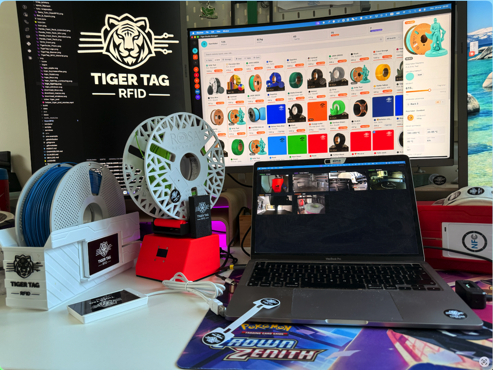
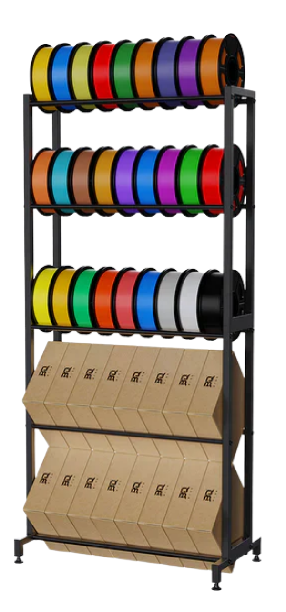
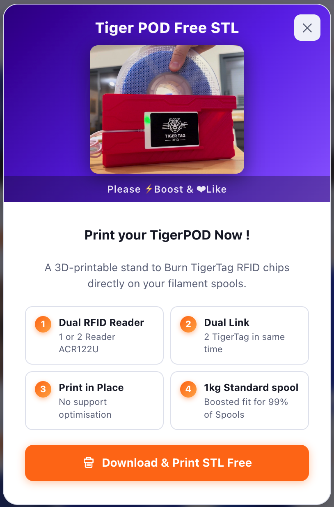
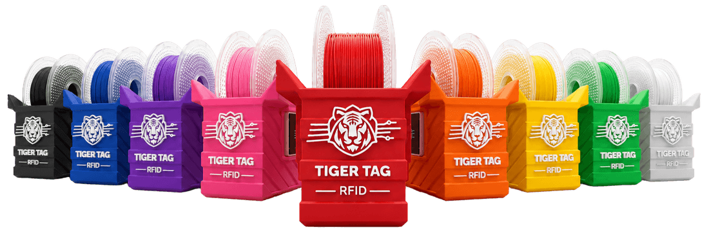
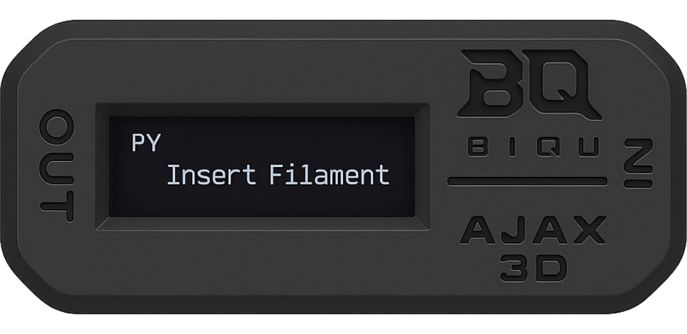
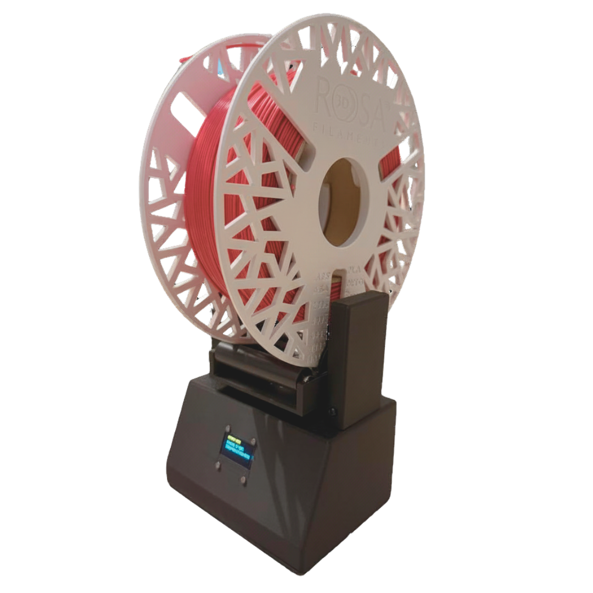
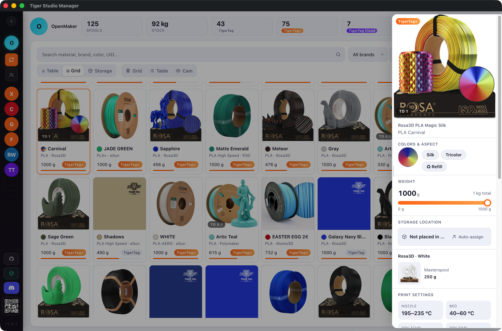
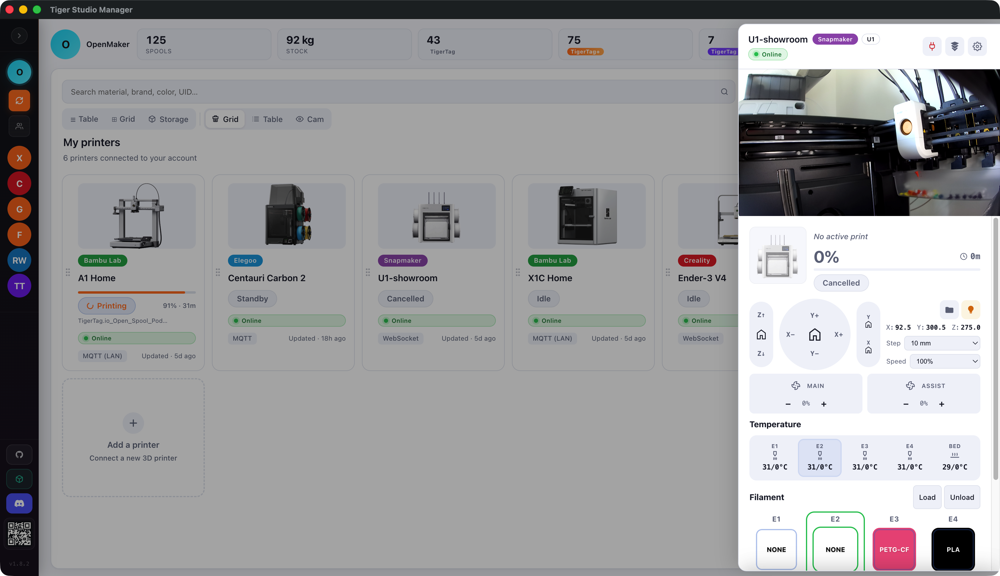
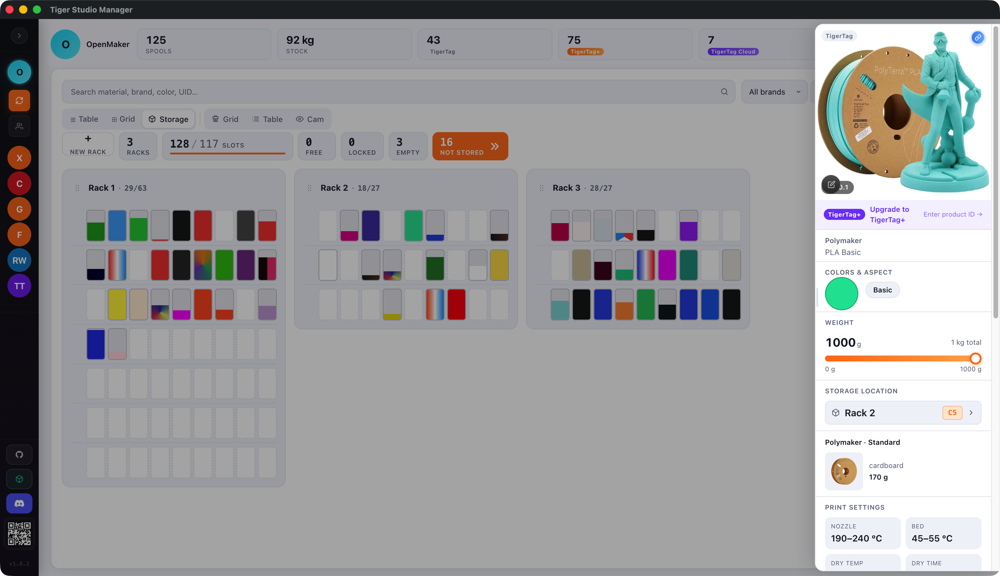
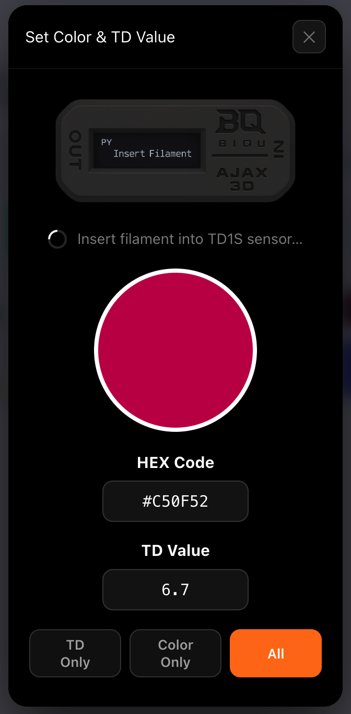

<div align="center">

# Tiger Studio Manager 2


**Desktop companion for the [TigerTag](https://tigertag.io) RFID filament-tracking ecosystem.**<br>
Manage your spool inventory, connect your 3D printers, and keep everything in sync — across devices, accounts, and friends.

<br>

<a href="https://github.com/TigerTag-Project/TigerTag-Studio-Manager/releases">
  
</a>
<br>
<a href="https://github.com/TigerTag-Project/TigerTag-Studio-Manager/releases">
  
</a>
<br>
<a href="https://github.com/TigerTag-Project/TigerTag-Studio-Manager/releases">
  
</a>

<br><br>

[](https://github.com/TigerTag-Project/TigerTag-Studio-Manager/releases/latest)

*Intel + Apple Silicon · macOS: Signed & Notarized · No installation knowledge required.*

<br>

[](https://github.com/TigerTag-Project/TigerTag-Studio-Manager/actions/workflows/build.yml)
[](LICENSE)
[](https://www.electronjs.org/)
[](https://nodejs.org/)

</div>

---

## What is it?

**[TigerTag](https://tigertag.io)** is an open RFID standard for tracking 3D-printing filament spools. Each spool carries an NFC chip with its full profile — brand, material, color, print settings — readable by any compatible app or reader. The ecosystem includes the mobile app, an open-source scale, a color sensor, and this desktop companion.

Tiger Studio Manager is an Electron desktop app that bridges your physical filament collection with the TigerTag cloud. Scan a spool's NFC chip, see its full profile (material, color, weight, print settings), update its weight on the scale, and push filament data directly to your connected printers — all in one window.

It works standalone (no reader needed), but unlocks its full potential with:
- an **ACR122U NFC reader** for automatic spool identification, chip encoding and Cloud-to-chip promotion
- a **TigerScale** ESP32 scale for live weight tracking
- one or more **3D printers** from the 6 supported brands


<p align="center"><em>…and the same thing on a real bench:</em></p>



> 🌐 **[tigertag.io](https://tigertag.io)** — official website: buy TigerTag chips, browse the filament catalogue, manage your account.

---

## A sandbox, not the product

Tiger Studio Manager is one piece of **TigerSystem**, the open ecosystem built around
the TigerTag protocol — and it is deliberately **a laboratory, not the destination**.

Everything you see here is a demonstration of what open, documented technology makes
possible once a filament spool can identify itself: live printer telemetry across six
brands, physical rack mapping, sensors, shared wishlists, chipless tracking. Some of it
will mature, some of it exists to prove a point, and all of it is readable, forkable and
free to copy.

The approach is **neutral and agnostic by design**. TigerTag takes no side between
filament brands, printer makers or distributors. It is not a walled garden with a
partner list — it is a format anyone can read and write.

> **Build your own.** TigerTag is an open protocol, not a platform you have to join.
> Nothing here is a prerequisite: read the [chip format](https://github.com/TigerTag-Project/TigerTag-RFID-Guide),
> pick up an [SDK](https://github.com/TigerTag-Project/TigerTag-SDK-JS), and build the
> software, the ecosystem or the business you actually want. This app is what *we*
> wanted — yours can be something else entirely, and it will still speak the same chips.

---

## Open source ecosystem

Everything around TigerTag is open — the hardware, the firmware, the SDK, and this app.

| Project | What it is | License |
|---|---|---|
| **[Tiger Studio Manager](https://github.com/TigerTag-Project/TigerTag-Studio-Manager)** | This app — desktop companion for filament management | MIT |
| **[TigerTag SDK for JavaScript](https://github.com/TigerTag-Project/TigerTag-SDK-JS)** | Parse, verify, and encode TigerTag NFC chips — used internally by this app | MIT |
| **[TigerTag SDK for Python](https://github.com/TigerTag-Project/TigerTag-SDK-Python)** | Parse, verify, and encode TigerTag NFC chips in Python — for scripts, tools, and automation | MIT |
| **[TigerScale](https://github.com/TigerTag-Project/Tiger-Scale)** | ESP32 firmware + hardware for the open-source filament scale | MIT |
| **[TigerPOD](https://github.com/TigerTag-Project/TigerPOD)** | Open-source dual NFC reader/writer stand for spools — 3D-printable shell + two USB readers ([free STL on MakerWorld](https://makerworld.com/en/models/1289152)) | CC BY 4.0 |

The **TigerTag SDK** is the low-level library that handles all NFC chip operations — reading the 144-byte NTAG payload, verifying the TigerTag format, and encoding new chip data. It is published as an npm package (`tigertag`) and can be used independently to build custom TigerTag-compatible tools.

---

## Features

> The highlights below are a curated subset. See **[FEATURES.md](./FEATURES.md)** for the complete, always-current catalogue of every shipped feature — grouped by domain, with the version each one landed.

### 🗂 Inventory
- Real-time Firestore sync — table view + grid view, column sort, full-text search
- Detail side panel — color, print settings, weight slider with auto-save, container, raw JSON
- Weight tracking — slider or manual entry; instant cloud sync after update
- **Container weight calibration** — correct a container's empty weight against your own scale, with a guided "how to measure" step; kept on your account and applied to every spool in that container (the bundled catalogue is never modified)
- **TigerData** — create fully-digital spools with no chip; promote to a real chip later, atomically
- Custom product image for DIY & Cloud spools
- Manufacturing date, twin-tag detection and manual repair
- Spool toolbox — scan color (TD1S), scan TD, link twin, remove from rack, delete
- **Multi-select** — tick several spools (or printers) and delete them together, with a hold-to-confirm
- **Guided chip update** — a step-by-step panel to re-write an existing chip: place it on the reader, UID-match check, verified write
- **Export / import `.ttag` files** — back up a spool or a whole selection to a portable file, keep it, carry it on a USB stick or share it, then import it back anywhere. Works for TigerData, TigerTag and TigerTag+ alike; import through a validate → preview → accept flow and choose **Restore** (put everything back exactly as it was) or **Import** (fresh spools you own). Pull in several files at once by browsing, pasting a link, or dragging them onto the window

### 🖨 3D Printer integration
Live integrations for 6 brands — real-time temperatures, filament per slot, active print job, camera:

| Brand | Protocol | Status |
|---|---|---|
| **Anycubic** | MQTTS 9883 (TLS) / cloud + ACE | ✅ Live |
| **Bambu Lab** | MQTTS 8883 (TLS) + AMS | ✅ Live |
| **Creality** | WebSocket 9999 + CFS | ✅ Live |
| **Elegoo** | MQTT 1883 + Canvas | ✅ Live |
| **FlashForge** | HTTP polling 8898 + matlStation | ✅ Live |
| **Snapmaker** | Moonraker WebSocket 7125 | ✅ Live |

Each brand supports: filament edit per slot, printer discovery (mDNS + port-scan + Add by IP), camera widget.

The **printers table** shows, per printer: a live **print preview** (the model on the bed), the current job, and an **"Ends at"** column with the wall-clock finish time — plus per-printer **tags** and a search bar with **Brand / State / Tags** filters to manage a whole fleet.

Some brands also expose a **live control panel** (Snapmaker, Elegoo, Anycubic): home / jog the axes, set nozzle & bed targets, toggle the light, control the part-cooling fan, pick the print-speed mode, and load / unload filament per slot.

### 📦 Storage / Racks



Organize your filament collection into physical racks — drag spools onto slots, auto-fill from inventory, and always know where each spool sits:
- **Drag-and-drop rack editor** — Skyline masonry layout, slot locking, auto-fill / auto-store
- **Rack builder** — a three-step side card: name and subtitle, levels and slots per level with − / + steppers, and a live preview that shows an existing rack's real contents while you resize it
- **Unranked panel** — spools not yet assigned to a rack, always visible at a glance
- **Rich hover tooltip** on filled slots — color swatch, weight bar, brand, and coordinates

### 🤝 Friends & Sharing
- Discovery code `XXX-XXX` — share with friends for O(1) lookup
- Send / accept / refuse / block friend requests
- View a friend's inventory in read-only mode, inline in the same UI
- Public inventory toggle for frictionless sharing

### ⚖ Sensors & Devices

#### ACR122U NFC reader
Plug in a USB ACR122U reader and the app automatically opens the matching spool's detail panel the moment you scan a chip — no button, no search, instant access.

#### 🐯 TigerPOD — free 3D-printable dual reader stand

<a href="https://makerworld.com/en/models/1289152">
  
</a>



The **TigerPOD** ([repository](https://github.com/TigerTag-Project/TigerPOD)) is a free 3D-printable stand designed to hold up to **two ACR122U readers** side by side. Place one or two TigerTag chips on it and encode both in a single click directly from Tiger Studio Manager — no manual positioning, no juggling readers.

| | |
|---|---|
| **Print** | No supports needed — print in place, fits 99 % of 1 kg standard spools |
| **Readers** | 1 or 2 × ACR122U — encode two chips simultaneously (Dual Link) |
| **License** | Free — download, print, use |

**[⬇ Download free STL on MakerWorld](https://makerworld.com/en/models/1289152)**

#### TD1S color sensor



The [TD1S](https://tigertag.io/products/biqu-ajax-td1s-v1-0) is TigerTag's USB filament color and transmission density sensor. Place the filament in the sensor and it reads:
- **Color** — precise HEX value written directly to the spool's `online_color_list`
- **TD value** — Transmission Density, a measure of filament transparency used by compatible slicers

The TD1S auto-opens a live viewer when plugged in. In the spool detail panel, scan color and TD separately or together. In the **Add Product** panel, the TD1S icon in the header glows green when connected — scanning auto-fills both fields in the form.

#### TigerScale



The [TigerScale](https://github.com/TigerTag-Project/Tiger-Scale) is an open-source ESP32-based filament scale. Tiger Studio Manager connects to it over WebSocket and shows a live card per scale:
- **56 px live weight display** with container / filament split
- **Send-status badge** — tracks the firmware lifecycle: `idle → scanning → stable → send → success`
- **Filament mini-panel** — color dot, brand, and material pushed directly from the scale firmware
- **Twin UID reader grid** — two NFC readers (left / right); the empty slot auto-fills with the Firestore-resolved twin tag in green
- **TARE** — hold-to-confirm button (1 s) that POSTs `/api/tare` to the scale firmware

#### USB scale (Dymo M-series)

Plug in a **Dymo USB scale** and your spool weights fill themselves in — no typing. Set a spool on the scale and, with a chip on the reader, its weight is saved automatically (gross → net, twin synced); with a spool's card open, a quick confirm does it. The live reading appears right inside the spool's weight panel, and a dimmed "asleep — tap to wake" hint shows when the scale powers itself down.

### 📱 TigerTag RFID Connect — mobile app
Tiger Studio Manager is the desktop companion to **TigerTag RFID Connect**, the iOS/Android mobile app. Both apps share the same Firebase backend (Firestore inventory, friends, racks) so changes made on one device appear immediately on the other.

The mobile app handles chip programming, NFC scanning on the go, and catalogue browsing. Tiger Studio Manager adds the desktop-class surfaces: multi-account management, rack organization, live printer integration, TD1S and TigerScale hardware, and bulk operations.

A QR code to download the mobile app is always accessible in the sidebar.

### 🌍 Accounts & i18n
- Multi-account — switch between multiple TigerTag accounts
- **9 locales** — EN · FR · DE · ES · IT · PL · PT (Brasil) · PT (Portugal) · 中文
- Per-account language preference synced with Firestore
- Google sign-in via loopback OAuth (RFC 8252 + PKCE) — Touch ID / passkey native support

---

## Screenshots

<div>

| Inventory | Printers |
|---|---|
|  |  |

| Storage Racks | Camera Wall |
|---|---|
|  |  |

| TD1S color sensor | TigerPOD |
|---|---|
|  |  |

</div>

---

## Getting started

### Requirements

- **Node.js** 24+
- **npm** 10+
- A **TigerTag account** — [tigertag.io](https://tigertag.io)
- _(Optional)_ An **ACR122U** NFC reader for chip read/write

#### Linux only

```bash
sudo apt-get install libpcsclite-dev libusb-1.0-0-dev build-essential
```

### Install & run

```bash
git clone --recurse-submodules https://github.com/TigerTag-Project/TigerTag-Studio-Manager.git
cd TigerTag-Studio-Manager
npm install   # also runs electron-rebuild for native NFC module
npm start
```

---

## Tech stack

| Layer | Technology |
|---|---|
| Desktop shell | [Electron](https://www.electronjs.org/) 41 |
| UI | Vanilla HTML / CSS / JavaScript (no framework, no bundler) |
| Auth & data | [Firebase](https://firebase.google.com/) (Auth + Firestore) |
| NFC reading | [nfc-pcsc](https://github.com/pokusew/nfc-pcsc) + ACR122U |
| NFC parsing | [TigerTag SDK for JavaScript](https://github.com/TigerTag-Project/TigerTag-SDK-JS) — parse, verify, write TigerTag chips |
| Auto-update | [electron-updater](https://www.electron.build/auto-update) via GitHub Releases |
| Build & packaging | [electron-builder](https://www.electron.build/) |
| macOS signing | Apple Developer ID + `notarytool` (App Store Connect API Key) |
| Windows signing | Not yet signed (planned — Microsoft Trusted Signing) |
| CI / Releases | GitHub Actions — triggered on `v*` tag push |

---

## Building installers

Push a `v*` tag to trigger a parallel build on all three platforms and publish a GitHub Release automatically:

```bash
git tag v1.7.0
git push origin v1.7.0
```

| Platform | Command | Output | Signed |
|---|---|---|---|
| macOS (signed) | `npm run build:mac` | `.dmg` + `.zip` (x64 + arm64) | ✅ Developer ID + Notarized |
| macOS (fast, local) | `npm run build:mac:unsigned` | `.dmg` | ❌ |
| Windows | `npm run build:win` | `.exe` NSIS | ❌ Not yet signed |
| Linux | `npm run build:linux` | `.AppImage` | N/A |
| All | `npm run build:all` | All three | — |

Built artifacts go to `dist/` (git-ignored).

> `npm run build:mac` requires Apple Developer credentials in a local `.env` file (see `.env.example`). The signing + notarization pipeline is documented in `docs/code-signing.md`.

---

## i18n tooling

UI strings live in `renderer/locales/<lang>.json`. Never edit the 9 locale files by hand — use the helper instead:

```bash
# Add a new key across all 9 locales
npm run i18n:add -- myKey en="Hello" fr="Bonjour" de="Hallo" \
  es="Hola" it="Ciao" zh="你好" pt="Olá" pt-pt="Olá" pl="Cześć"

# Insert after an existing key (keeps related keys grouped)
npm run i18n:add -- myKey --after toolboxTitle en="Hello" ...

# Check consistency (also runs automatically as a pre-commit hook)
npm run i18n:check
```

The pre-commit hook blocks any commit that leaves locale files inconsistent (missing keys, type mismatches, empty strings). It is activated automatically by `npm install` via the `prepare` script.

---

## Multi-vendor RFID (planned)

The app currently reads only TigerTag chips. Per-vendor spec sheets for extending support are in `docs/rfid-vendors/`:

| Vendor | Tag type | Auth | Spec |
|---|---|---|---|
| 🐯 TigerTag | NTAG/NDEF | None | [tigertag.md](./docs/rfid-vendors/tigertag.md) |
| 🟢 Bambu Lab | Mifare Classic 1K | HKDF-SHA256 | [bambu.md](./docs/rfid-vendors/bambu.md) |
| 🟠 Creality | Mifare Classic 1K | AES-128-ECB | [creality.md](./docs/rfid-vendors/creality.md) |
| 🔴 Anycubic | Mifare Ultralight | None | [anycubic.md](./docs/rfid-vendors/anycubic.md) |
| ⚫ Elegoo | Mifare Ultralight | Magic bytes | [elegoo.md](./docs/rfid-vendors/elegoo.md) |
| 🟣 Snapmaker | Mifare Classic 1K | HKDF + RSA-2048 | [snapmaker.md](./docs/rfid-vendors/snapmaker.md) |
| 🟡 Qidi | Mifare Classic 1K | Default key | [qidi.md](./docs/rfid-vendors/qidi.md) |
| 🌐 Openspool | NFC Type 2 NDEF | None | [openspool.md](./docs/rfid-vendors/openspool.md) |

The [OpenRFID](https://github.com/suchmememanyskill/OpenRFID) project is vendored as a Git submodule under `OpenRFID/` as a read-only reference.

---

## Project structure

```
TigerTag-Studio-Manager/
├── main.js                  # Electron main process (IPC, printer transports, NFC, cameras) — see CODEMAP-main.md
├── preload.js               # contextBridge IPC
├── CODEMAP-main.md          # Line-range index for main.js
├── ROADMAP.md               # Done / next / backlog by domain
├── services/
│   ├── nfc-process.js       # NFC utilityProcess — nfc-pcsc read/write, isolated from the main process
│   ├── tigertagDbService.js # Reference data layer (API → GitHub mirror → userData → assets)
│   └── anycubicCloudCerts.js
├── renderer/
│   ├── inventory.html       # Single-page UI markup
│   ├── inventory.js         # Core renderer logic (~21k-line ES module — see CODEMAP.md)
│   ├── CODEMAP.md           # Line-range index for inventory.js (read first, grep last)
│   ├── firebase.js          # Firebase init (public config)
│   ├── css/                 # 10 themed files, loaded in order (00-base → 10-settings → … → 70-detail-misc)
│   ├── locales/             # i18n JSON — en fr de es it zh pt pt-pt pl (9 locales, edit via npm run i18n:add)
│   ├── IoT/                 # Extracted device modules (own CSS inside each)
│   │   ├── tigerscale/      # TigerScale — Firestore subscription, panel, health tick
│   │   └── td1s/            # TD1S color/TD sensor engine + TD/Color edit modals
│   ├── rfid_protocol/
│   │   └── tigertag/        # RFID TigerTag tester modal + chip parser
│   ├── cam/                 # Detached camera-wall window
│   └── printers/            # Per-brand live integrations + PROTOCOL.md agent skills
│       ├── anycubic/  bambulab/  creality/  elegoo/  flashforge/  snapmaker/
│       └── registry.js  context.js  cam_manager.js  modal-helpers.js  extra-subnets.js   # shared
├── assets/
│   ├── db/tigertag/         # Bundled reference JSONs (id_brand, id_material, …)
│   ├── img/                 # App icons + printer photos
│   └── svg/                 # UI icons + TigerTag logos
├── data/
│   ├── container_spool/     # Spool container catalog
│   ├── printers/            # Per-brand printer model catalogs
│   ├── rack-presets.json    # Built-in rack templates
│   ├── whatsnew.json        # "What's New" modal content (9 locales, full history)
│   └── release-notes/       # Per-version GitHub Release body (BambuLab-style)
├── scripts/                 # i18n add/check, whatsnew add/check, codemap check, changelog extract, …
├── docs/
│   ├── firestore-schema.md  # Full Firestore collection/field map
│   ├── i18n-keys.md         # i18n key reference
│   └── rfid-vendors/        # Per-vendor RFID spec sheets
├── OpenRFID/                # Git submodule — upstream multi-vendor parsers (read-only)
└── .github/workflows/
    └── build.yml            # CI: prepare-release (draft + notes) → parallel build → attach assets, on tag push
```

---

## Contributing

1. **Fork** the repository
2. **Create a branch**: `git checkout -b feat/my-feature`
3. **Make your changes** — vanilla JS, no frameworks
4. **Run**: `npm start` to test locally
5. **Open a Pull Request**

Guidelines: keep the renderer vanilla (no React/Vue), add i18n strings with `npm run i18n:add` (all 9 locales), don't commit `node_modules/` or `dist/`.

**Reporting issues** — use [GitHub Issues](https://github.com/TigerTag-Project/TigerTag-Studio-Manager/issues). Use **Settings → Debug → Report a problem** in the app to copy a self-contained diagnostic report (version, platform, last 50 errors) to paste into your issue.

---

## Changelog · Roadmap

- 📚 **[FEATURES.md](./FEATURES.md)** — complete catalogue of every shipped feature, grouped by domain (current as of the latest release)
- 📋 **[CHANGELOG.md](./CHANGELOG.md)** — full version history
- 🗺 **[ROADMAP.md](./ROADMAP.md)** — planned features, in-flight work, and backlog

---

## License

[MIT](LICENSE) — © TigerTag Project

You are free to use, modify, and distribute Tiger Studio Manager — including commercially.
The **"TigerTag"** name is a trademark of the TigerTag Project — see [TRADEMARK.md](TRADEMARK.md) for usage conditions.
All npm dependencies are permissive (MIT / ISC / BSD / Apache) — see [THIRD_PARTY_LICENSES.md](THIRD_PARTY_LICENSES.md).
